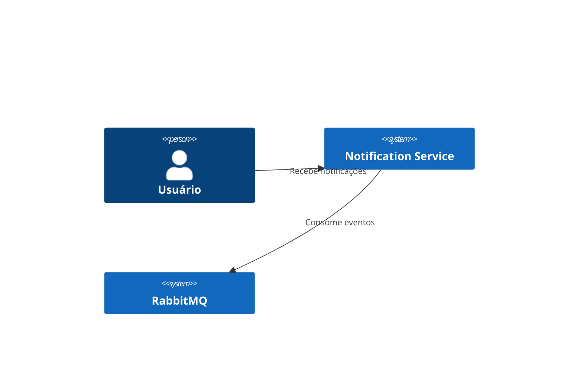

# Notification Service

Serviço responsável por receber eventos de transações via RabbitMQ e enviar notificações por e-mail e push.

## Executando

### Maven
```bash
mvn spring-boot:run -pl notification-service
```

### Docker
```bash
docker build -t notification-service .
```

## Variáveis de Ambiente
- `RABBITMQ_HOST` (default `localhost`)
- `RABBITMQ_PORT` (default `5672`)
- `RABBITMQ_USER` (default `guest`)
- `RABBITMQ_PASSWORD` (default `guest`)
- `TRANSACTION_QUEUE` (default `transactions.queue`)
- `OTEL_EXPORTER_OTLP_ENDPOINT` (default `http://otel-collector:4318/v1/metrics`)

## Endpoints

```bash
curl http://localhost:8081/actuator/health
curl http://localhost:8081/actuator/metrics
```

## Diagrama C4


## ADR
- [Decisão inicial](docs/adr/0001-notification-service.md)